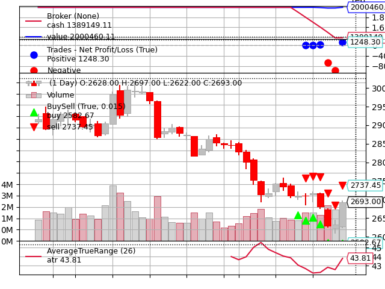

# AI量化回测系统

这是一个基于Python的AI量化回测系统，集成了预测模型和回测引擎，用于期货交易策略的回测和评估。系统设计为可插拔的预测模型架构，您可以轻松地接入不同的AI或其他预测方法。

## 功能特点

- **可插拔的预测模型接口**：支持接入各种预测模型（如LSTM、机器学习模型、统计模型等）
- 支持期货合约的回测
- 自动计算保证金和手续费
- 提供详细的回测报告和可视化
- 支持自定义策略参数
- 自动保存回测结果和预测数据

## 系统要求

- Python 3.8+
  - backtrader
  - pandas
  - numpy
- scikit-learn (如果使用基于sklearn的预测模型)
- torch (如果使用基于PyTorch的预测模型，如示例中的LSTM)
  - psutil

## 安装步骤

1. 克隆项目：
```bash
git clone [项目地址]
cd ai-quant-backtest
```

2. 安装依赖：
```bash
pip install -r requirements.txt
```

## 项目结构

```
ai-quant-backtest/
├── backtest_engine.py      # 回测引擎主程序
├── models/
│   └── lstm_predictor.py   # LSTM预测模型示例
├── strategies/
│   └── AI_KDJ_Strategy.py  # 交易策略实现
├── tools/
│   ├── db_mysql.py        # 数据库连接工具
│   └── Log.py            # 日志工具
└── requirements.txt       # 项目依赖
```

## 使用方法

1. 创建预测器：
   - 您的预测模型需要封装成一个类，并实现一个 `predict(self, dataframe)` 方法。
   - `predict` 方法应接受一个pandas DataFrame作为输入，并返回两个列表/numpy数组：预测价格序列和对应的日期序列。
   - 示例 (`models/lstm_predictor.py`) 中展示了一个基于LSTM的预测器实现。

```python
import torch
import torch.nn as nn
import numpy as np
import pandas as pd
from sklearn.preprocessing import MinMaxScaler
from datetime import datetime, timedelta

class LSTMPredictor(nn.Module):
    def __init__(self, input_dim=5, hidden_dim=64, num_layers=2, output_dim=1):
        super(LSTMPredictor, self).__init__()
        self.hidden_dim = hidden_dim
        self.num_layers = num_layers

        self.lstm = nn.LSTM(input_dim, hidden_dim, num_layers, batch_first=True)
        self.fc = nn.Linear(hidden_dim, output_dim)

    def forward(self, x):
        h0 = torch.zeros(self.num_layers, x.size(0), self.hidden_dim).to(x.device)
        c0 = torch.zeros(self.num_layers, x.size(0), self.hidden_dim).to(x.device)
        out, _ = self.lstm(x, (h0, c0))
        out = self.fc(out[:, -1, :])
        return out

class PricePredictor:
    def __init__(self, model_path=None):
        self.model = LSTMPredictor()
        self.scaler = MinMaxScaler()
        if model_path:
            self.model.load_state_dict(torch.load(model_path))
        self.model.eval()

    def prepare_data(self, df, sequence_length=10):
        """准备LSTM输入数据"""
        features = ['open', 'high', 'low', 'close', 'vol']
        data = df[features].values
        scaled_data = self.scaler.fit_transform(data)

        X = []
        for i in range(len(scaled_data) - sequence_length):
            X.append(scaled_data[i:(i + sequence_length)])
        return np.array(X)

    def predict(self, df, predict_days=None):
        """
        预测未来价格
        :param df: 历史数据DataFrame
        :param predict_days: 预测天数，如果为None则预测整个回测区间
        :return: 预测价格和日期
        """
        sequence_length = 10
        X = self.prepare_data(df, sequence_length)

        if len(X) == 0:
            raise ValueError("没有足够的数据进行预测")

        X = torch.FloatTensor(X)
        with torch.no_grad():
            predictions = self.model(X)

        # 创建一个与原始数据相同形状的数组，只填充预测的收盘价
        dummy_array = np.zeros((len(predictions), 5))
        dummy_array[:, 3] = predictions.numpy().flatten()  # 将预测值放在收盘价位置

        # 反归一化预测结果
        predictions = self.scaler.inverse_transform(dummy_array)[:, 3]  # 只取收盘价列

        # 生成预测日期
        last_date = df.index[-1]
        if predict_days is None:
            # 计算回测区间的天数
            start_date = df.index[0]
            predict_days = (last_date - start_date).days + 1

        # 确保预测天数和预测结果长度一致
        predict_days = min(predict_days, len(predictions))
        predictions = predictions[:predict_days]

        predict_dates = [(last_date + timedelta(days=i+1)).strftime('%Y%m%d') 
                        for i in range(predict_days)]

        # 打印调试信息
        print(f"预测天数: {predict_days}")
        print(f"预测价格数量: {len(predictions)}")
        print(f"预测日期数量: {len(predict_dates)}")

        return predictions, predict_dates
```

2. 运行回测示例：
   您可以直接运行 `demo.py` 文件来执行一个回测示例。

   ```bash
   python demo.py
   ```

3. `demo.py` 源代码：

```python
from backtest_engine import BacktestEngine
from models.lstm_predictor import PricePredictor
from tools import Log

# 使用示例
# 创建一个预测器实例（这里使用LSTM作为示例）
lstm_predictor = PricePredictor()

# 创建回测引擎实例，传入预测器
engine = BacktestEngine(init_cash=2000000, commission=0.0001, predictor=lstm_predictor)

# 设置回测参数
symbol = '1200'  # 螺纹钢期货
freq = 'day'
strategy_start_date = '20241201'
strategy_end_date = '20241220'

try:
    # 运行回测（现在包含了预测过程）
    results = engine.run_backtest(
        symbol=symbol,
        freq=freq,
        strategy_start_date=strategy_start_date,
        strategy_end_date=strategy_end_date
    )

    # 保存结果
    engine.save_results(results)

    # 绘制结果
    engine.plot_results()

except Exception as e:
    Log.log(f"回测失败: {str(e)}")
```

4. 回测结果包含：
   - 初始资金和最终资金
   - 总收益率
   - 最大回撤
   - 交易次数和胜率
   - 预测价格数据
   - 交易信号表
   - 每日权益曲线

## 回测结果示例

### 回测参数
- 初始资金：2,000,000.00
- 回测区间：2024-12-01 至 2024-12-20
- 交易品种：期货合约
- 手续费率：0.0001
- 预测模型：LSTM

### 回测结果
- 最终权益：1,536,699.11
- 权益最大回撤：588,279.32
- 最大回撤率：38.27%
- 总交易次数：8
- 最大单笔盈利：147,550.00
- 最大单笔亏损：-81,840.00
- 盈利次数：4
- 亏损次数：2
- 胜率：66.67%
- 盈亏比：1.80

### 信号表示例
```
   predict_date  predict_price  kdj_signal  position signal_text
0    2024-12-02    2601.663189           3      0.00        强烈看空
1    2024-12-03    2601.296798           1      0.00        中性偏空
2    2024-12-04    2600.942668           1      0.00        中性偏空
...
```
### 每日权益曲线示例


### 结果文件
- 预测结果：backtest_results/predictions.csv
- 信号表：backtest_results/AI_KDJ_signal_table.csv
- 每日权益记录：backtest_results/AI_KDJ_equity.csv
- 交易记录：backtest_results/signal_info.csv
- 回测摘要：backtest_results/backtest_summary.csv

## 注意事项

1. 数据库配置：
   - 确保MySQL数据库已正确配置
   - 检查数据库连接参数

2. 数据要求：
   - 回测数据需要至少27天的历史数据（用于计算ATR）
   - 数据格式要求：包含trade_date, open, high, low, close, vol字段

3. 内存管理：
   - 系统会自动清理内存缓存
   - 长时间回测时注意监控内存使用

## 常见问题

1. 数据不足错误：
   - 确保有足够的历史数据用于预测
   - 检查数据表名是否正确

2. 内存溢出：
   - 适当调整_clean_memory中的save_num参数
   - 考虑分批处理大量数据

## 后续开发计划

1. 完善预测模型接口定义和文档
2. 添加更多技术指标
3. 添加实时交易接口
4. 优化回测性能

## 贡献指南

欢迎提交Issue和Pull Request来帮助改进项目。

## 许可证

[添加许可证信息] 